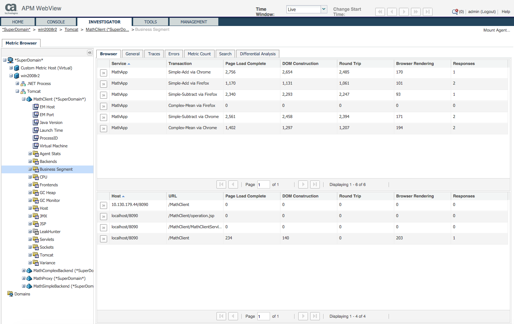
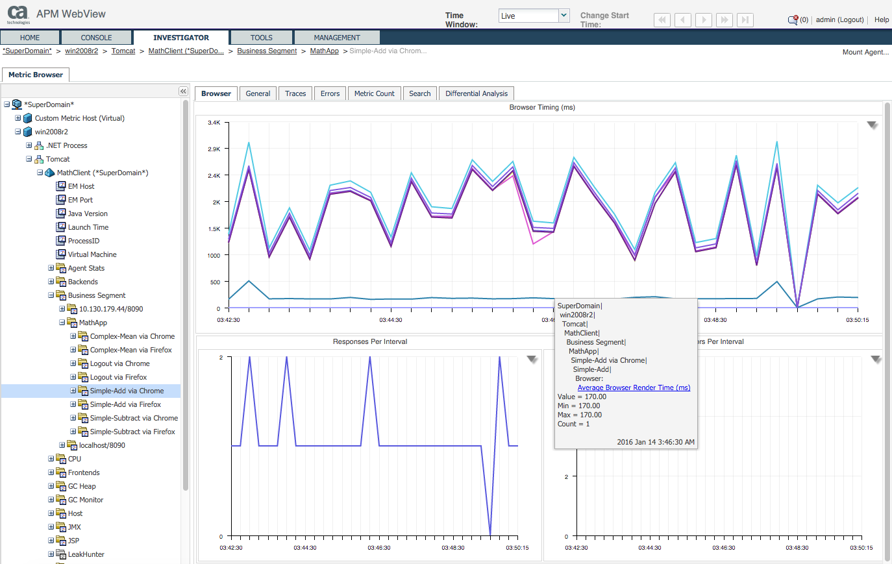

# Browser Agent Typeviewer (1.0)

## Description
This typeviewer provides overviews and a stacked view of Navigation Timing API metrics for CA APM Browser Agent:

## APM version
Tested with CA APM 10.1.

## Dependencies
Tested with CA APM 10.1.

## Limitations
Only works for Page Load metrics, not AJAX or Javascript metrics.

## License
[Apache License 2.0](LICENSE).

# Installation Instructions
Copy ext/xmltv/browser.typeviewers.xml to <EM_HOME>ext/xmltv on your MOM.

# Support
This document and associated tools are made available from CA Technologies as examples and provided at no charge as a courtesy to the CA APM Community at large. This resource may require modification for use in your environment. However, please note that this resource is not supported by CA Technologies, and inclusion in this site should not be construed to be an endorsement or recommendation by CA Technologies. These utilities are not covered by the CA Technologies software license agreement and there is no explicit or implied warranty from CA Technologies. They can be used and distributed freely amongst the CA APM Community, but not sold. As such, they are unsupported software, provided as is without warranty of any kind, express or implied, including but not limited to warranties of merchantability and fitness for a particular purpose. CA Technologies does not warrant that this resource will meet your requirements or that the operation of the resource will be uninterrupted or error free or that any defects will be corrected. The use of this resource implies that you understand and agree to the terms listed herein.

Although these utilities are unsupported, please let us know if you have any problems or questions by adding a comment to the CA APM Community Site area where the resource is located, so that the Author(s) may attempt to address the issue or question.

Unless explicitly stated otherwise this field pack is only supported on the same platforms as the APM core agent. See [APM Compatibility Guide](http://www.ca.com/us/support/ca-support-online/product-content/status/compatibility-matrix/application-performance-management-compatibility-guide.aspx).

# Change log
Changes for each version of the field pack.

Version | Author | Comment
--------|--------|--------
1.0 | guenter.grossberger@ca.com | First version of the field pack.

## Support URL
https://github.com/CA-APM/browser-agent-typeview/issues

## Short Description
Navigation Timing API metrics for CA APM Browser Agent

## Categories
Examples